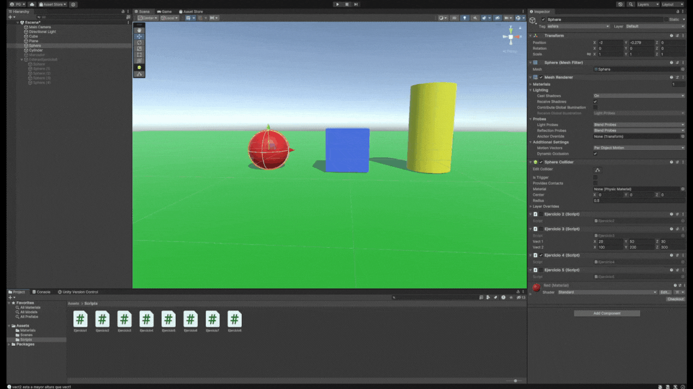
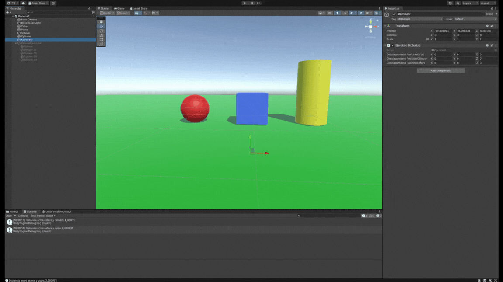

# p02-scripts-unity
## Ejercicio 1.


La idea de funcionamiento es asignarle una variable `frameActualizacion` que se encargue de elegir el número de frames que tienen que pasar para que se actualice un color. Este valor es público para que pueda ser accedido desde el inspector y entonces pueda ser modificado.
El contador de frames se actualiza cada frame en el método `Update`. Para el vector de color que se pide se ha utilizado un array de tipo float de tamaño 3, aunque de la manera en la que se está utilizando se podría cambiar por un objeto `Vector3` y funcionaría de la misma manera.
```c#
public class Ejercicio1 : MonoBehaviour
{
    public uint frameActualizacion = 120;
    private Renderer rd;
    private int frameActual;
    private float[] vectorColor;
    // Start is called before the first frame update
    void Start()
    {
        rd = GetComponent<Renderer>();
        frameActual = 0;
        vectorColor = new float[3] {Random.Range(0.0f, 1.0f), Random.Range(0.0f, 1.0f), Random.Range(0.0f, 1.0f)};
        rd.material.color = new Color(vectorColor[0], vectorColor[1], vectorColor[2]);
    }

    // Update is called once per frame
    void Update()
    {
        if (frameActual == frameActualizacion) {
            frameActual = 0;
            int posicionAleatoria = Random.Range(0, 2);
            vectorColor[posicionAleatoria] = Random.Range(0.0f, 1.0f);
            // Actualización de las componentes.
            rd.material.color = new Color(vectorColor[0], vectorColor[1], vectorColor[2]);
        }
        ++frameActual;
    }
}
```

## Ejercicio 2.


Este sencillo script se aplica a cada objeto de la escena, él cual escribe su nombre por pantalla.
```c#
public class Ejercicio2 : MonoBehaviour
{
    // Start is called before the first frame update
    void Start()
    {
        Debug.Log(gameObject.name);
    }

    // Update is called once per frame
    void Update()
    {
        
    }
}
```

## Ejercicio 3.


Se han empleado métodos de la clase `Vector3` así como propiedades de objetos de la clase para resolver este problema. En el caso de la altura, se ha interpretado que la altura está dada por el eje `y` del vector.
```c#
public class Ejercicio3 : MonoBehaviour
{
    public Vector3 vect1 = new Vector3(0, 0, 0);
    public Vector3 vect2 = new Vector3(0, 0, 0);
    // Start is called before the first frame update
    void Start()
    {
        Debug.Log("Magnitud vect1: " + vect1.magnitude);
        Debug.Log("Magnitud vect2: " + vect2.magnitude);
        Debug.Log("Angulos entre vect1 y vect2: " + Vector3.Angle(vect1, vect2));
        Debug.Log("Distancia entre vect1 y vect2: " + Vector3.Distance(vect1, vect2));
        if (vect1.y > vect2.y) {
            Debug.Log("vect1 esta a mayor altura que vect2");
        } else if (vect1.y < vect2.y) {
            Debug.Log("vect2 esta a mayor altura que vect1");
        } else {
            Debug.Log("Los dos vectores estan a la misma altura");
        }  
    }

    // Update is called once per frame
    void Update()
    {
    }
}
```

## Ejercicio 4.


Este script devuelve la posición del objeto que lo ejecute.
```
public class Ejercicio4 : MonoBehaviour
{
    // Start is called before the first frame update
    void Start()
    {
        Debug.Log(transform.position);
    }

    // Update is called once per frame
    void Update()
    {
        
    }
}
```

## Ejercicio 5.


Se buscan los `GameObject` con  `GameObject.FindWithTag` y luego se calcula la distancia con el método apropiado de la clase `Vector3`, accediendo a la componente `Transform` de cada objeto.
```
public class Ejercicio5 : MonoBehaviour
{
    // Start is called before the first frame update
    void Start()
    {
        GameObject cilindro = GameObject.FindWithTag("cilindro");
        GameObject cubo = GameObject.FindWithTag("cubo"); 
        // Debug.Log("Distancia entre cilindro y cubo: " + Vector3.Distance(cilindro.transform.position, cubo.transform.position));
        Debug.Log("Distancia entre esfera y cilindro: " + Vector3.Distance(cilindro.transform.position, gameObject.transform.position));
        Debug.Log("Distancia entre esfera y cubo: " + Vector3.Distance(cubo.transform.position, gameObject.transform.position));
    }

    // Update is called once per frame
    void Update()
    { 
    }
}
```

## Ejercicio 6.


Haciendo uso de GetKeyDown
```
public class Ejercicio6 : MonoBehaviour
{
    public Vector3 desplazamientoPosicionCubo, desplazamientoPosicionCilindro, desplazamientoPosicionEsfera; 

    // Start is called before the first frame update
    void Start()
    {
        // Posiciones relativas
        desplazamientoPosicionCilindro = new Vector3(-4f, 0f, 0f);
        desplazamientoPosicionEsfera = new Vector3(4f, 0f, 0f);
        desplazamientoPosicionCubo = new Vector3(0f, 1f, 0f);  
    }

    // Update is called once per frame
    void Update()
    {
        if (Input.GetKeyDown(KeyCode.Space)) {
            // Posiciones relativas
            GameObject.FindWithTag("cilindro").GetComponent<Transform>().position += desplazamientoPosicionCilindro;
            GameObject.FindWithTag("cubo").GetComponent<Transform>().position += desplazamientoPosicionCubo;
            GameObject.FindWithTag("esfera").GetComponent<Transform>().position += desplazamientoPosicionEsfera;
        }
    }
}
```

## Ejercicio 7.


## Ejercicio 8.

